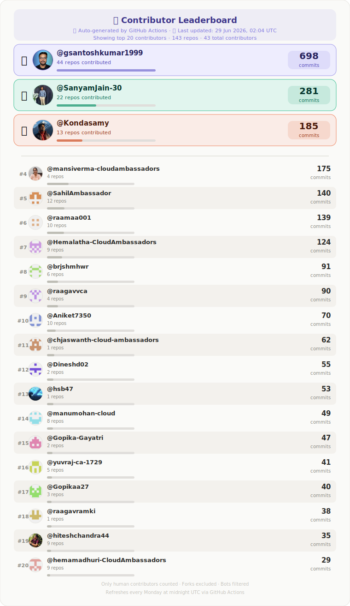

<h1 align="center"><a href="https://cloudambassadors.com/">Cloud Ambassadors</a></h1>
<h3 align="center"> Maximizing cloud impact through sensible engineering</h3>

  

<!-- LEADERBOARD_START -->

  

<!-- LEADERBOARD_END -->

